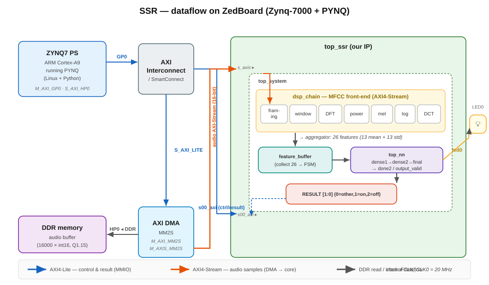
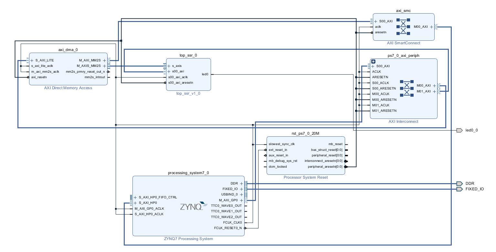

# Simple Speech Recognition (SSR) on FPGA — ZedBoard + PYNQ

Hardware implementation of single voice-command recognition (keyword spotting) on a
**ZedBoard (Zynq-7000, XC7Z020)** running the **built-in PYNQ** image. The audio is
pre-loaded into memory, streamed to a custom RTL core through an **AXI DMA**, processed
by a fixed-point **MFCC** front-end, and classified by a small **neural network**.

> 📓 **Full report (with plots, diagrams and runnable code):** [`SSR_report_EN.ipynb`](SSR_report_EN.ipynb)
> *(GitHub renders the notebook directly — click to open.)*

---

## Overview

Instead of a live microphone + ADC, the audio signal is held in memory and the whole flow
is driven by the embedded **ARM Cortex-A9** (Zynq PS) running PYNQ (Linux + Python). The
processor streams the samples to the recognition core over AXI DMA and reads the result
back over AXI4-Lite.

Three classes are recognised:

| Output | Class | Meaning |
|:------:|:------|:--------|
| `00` | **OTHER** | command not recognised |
| `01` | **ON** | command "on" → LED on |
| `10` | **OFF** | command "off" → LED off |

Audio: **16 kHz**, 1 s (16000 samples), **Q1.15** fixed point. Recognition uses the
time-frequency content (MFCC), not amplitude.

---

## Processing pipeline

```
audio (memory) → AXI DMA → top_ssr ┌── dsp_chain (MFCC) ──┐ → feature_buffer → top_nn → RESULT / LED
                                    framing · window · DFT ·
                                    power · mel · log · DCT ·
                                    aggregator (26 features)
```

- **dsp_chain** — 8 AXI4-Stream modules turning audio into a 26-element feature vector
  (13 MFCC means + 13 MFCC std), all fixed-point. Coefficients in `.mem` ROMs
  (Hamming window, DFT twiddles, mel filterbank, DCT).
- **feature_buffer** — FSM that collects the 26 features and starts the network.
- **top_nn** — dense(26→32, ReLU) → dense(32→3) → argmax → 2-bit command.

### Data flow on the ZedBoard



*ARM/PYNQ controls the AXI DMA over AXI4-Lite; the DMA reads the audio buffer from DDR and
streams it (AXI4-Stream) into `top_ssr`, which runs the MFCC front-end and the neural
network; the result is read back over AXI4-Lite and drives `led0`. Single 20 MHz clock domain.*

---

## Block design (Vivado)

ZYNQ7 PS + AXI DMA + AXI Interconnect/SmartConnect + `top_ssr`, single 20 MHz fabric clock.



---

## `top_ssr` register map (AXI4-Lite)

| Offset | Name | Access | Description |
|:------:|:-----|:------:|:------------|
| `0x00` | CTRL | W | bit0 `soft_reset` |
| `0x04` | STATUS | R | bit0 `output_valid`, bit1 `busy`, bit2 `s_axis_ready` |
| `0x08` | RESULT | R | `[1:0]` result (0 = other, 1 = on, 2 = off) |

Audio enters through an **AXI4-Stream slave** (`s_axis`) fed by the DMA (`M_AXIS_MM2S`);
`s_axis_tlast` is generated by the DMA at the end of the transfer.

---

## Resource utilisation & timing (XC7Z020)

| Resource | Used | Available | Utilisation |
|:---------|-----:|----------:|------------:|
| LUT  | 31 858 | 53 200  | ~60% |
| FF   | 21 083 | 106 400 | ~20% |
| DSP  | 95     | 220     | ~43% |
| BRAM | 1.5    | 140     | ~1% |

| WNS | TNS | WHS | THS | TPWS | Failed routes | Power |
|----:|----:|----:|----:|-----:|--------------:|------:|
| +22.098 ns | 0.000 | +0.039 ns | 0.000 | 0.000 | 0 | 1.701 W |

All timing constraints **met with a wide margin** — no setup/hold violations at 20 MHz.

---

## Results

### Neural-network simulation (`top_nn_tb.sv`)

Feature vectors from real recordings fed into the network (0 = other, 1 = on, 2 = off):

| Input | NN output | Expected | |
|:------|:---------:|:--------:|:--:|
| ON_GOOD  | 1 (on)  | 1 | ✅ |
| OFF_GOOD | 2 (off) | 2 | ✅ |
| OTH_GOOD | 0 (other) | 0 | ✅ |
| ON_BAD   | 2 / 0   | 1 | ❌ |
| OFF_BAD  | 1       | 2 | ❌ |
| OTH_BAD  | 1       | 0 | ❌ |

All clean ("good") recordings are classified correctly, confirming the network and the
feature interface are functionally correct.

### Hardware (ZedBoard + PYNQ)

The design was **successfully deployed and runs end-to-end on the board**: the bitstream
loads as a PYNQ Overlay, the DMA streams each file, the core computes the MFCC features
and the classification, and the result is read back over AXI4-Lite.

| File | RESULT | Class |
|:-----|:------:|:-----:|
| `synth_on.mem` | 0 | OTHER |
| `synth_off.mem` | 0 | OTHER |
| `synth_other.mem` | 0 | OTHER |

> ⚠️ **On the board the result is always `OTHER`.** The data flow is correct (verified
> end-to-end — the DMA streams the samples, `dsp_chain` consumes them, the network completes
> and the result is read back), but **after implementation on hardware the effective accuracy
> of the network dropped drastically** compared with simulation: no input is classified as
> ON or OFF. The pipeline itself works (it loads, runs and returns a result for every input),
> while the same network in simulation classifies clean inputs correctly.

---

## Running it (PYNQ)

```python
from pynq import Overlay, allocate
ol  = Overlay("ssr.bit")          # programs the PL
dma = ol.axi_dma_0
ssr = ol.top_ssr_0                # AXI4-Lite (MMIO)

def classify_file(path):
    data = load_mem(path)         # .mem -> int16 (Q1.15)
    ssr.write(0x00, 1)            # soft reset
    buf[:] = data
    dma.sendchannel.transfer(buf) # stream samples to the core
    dma.sendchannel.wait()
    while not (ssr.read(0x04) & 0x1):  # wait for output_valid
        pass
    return ssr.read(0x08) & 0x3   # 0 = other, 1 = on, 2 = off
```

Put `ssr.bit`, `ssr.hwh`, the `.mem` files and the notebook in one folder on the board,
then open it in Jupyter (PYNQ).

---

## Repository layout

| Path | Contents |
|:-----|:---------|
| `rtl/audio_processing/` | MFCC pipeline (`dsp_chain` and modules) + coefficient `.mem` files |
| `rtl/neural_network_optim/` | Neural network (`top_nn`, dense layers, `final_layer`) |
| `rtl/top_ssr.sv`, `top_system.sv` | Top wrapper and recognition core |
| `pynq_zedboard_ssr/` | Vivado project (block design) |
| `PYNQ_files/` | `ssr.bit`, `ssr.hwh`, `.mem` files, PYNQ notebook |
| `sim/` | Testbenches and Python model |
| `SSR_report_EN.ipynb` | **Full report** |

---

## Authors

**Mateusz Gibas · Kacper Ferdek**

AGH University of Science and Technology, Kraków
